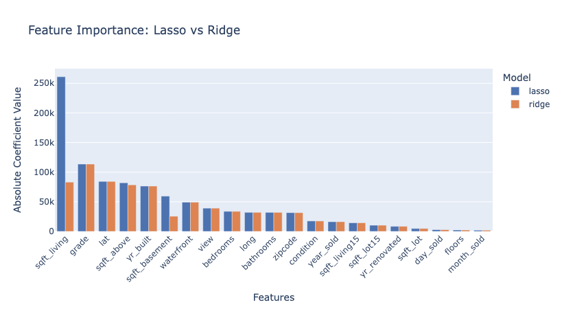
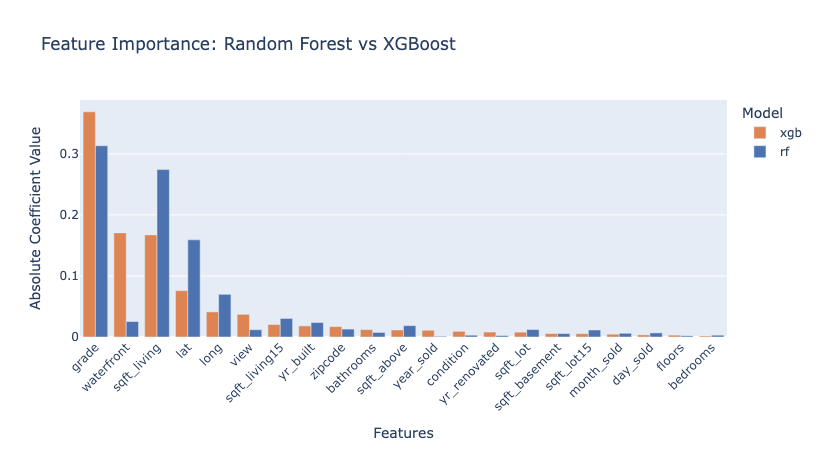

# King County House Sales - Machine Learning Price Prediction

- [King County House Sales - Machine Learning Price Prediction](#king-county-house-sales---machine-learning-price-prediction)
  - [📖 Project Overview](#-project-overview)
    - [📊 Dataset Description](#-dataset-description)
  - [Project Structure](#project-structure)
    - [1. Baseline Models](#1-baseline-models)
      - [Baseline Model Performance](#baseline-model-performance)
    - [2. Feature Importance Analysis](#2-feature-importance-analysis)
    - [3. Outliers Analysis](#3-outliers-analysis)
      - [Outlier Strategy Comparison (Test Results)](#outlier-strategy-comparison-test-results)
    - [4. Feature Selection](#4-feature-selection)
    - [5. Feature Engineering](#5-feature-engineering)
    - [6. Model Optimization](#6-model-optimization)
      - [Random Forest (Best Model)](#random-forest-best-model)
      - [XGBoost](#xgboost)
      - [Gradient Boosting](#gradient-boosting)
  - [💡 Key Findings](#-key-findings)
  - [🛠️ Technologies Used](#️-technologies-used)
  - [Results Summary](#results-summary)
  - [Usage](#usage)
  - [👤 Authors](#-authors)

## 📖 Project Overview

A comprehensive machine learning project to predict house prices in King County, Washington, using multiple regression algorithms, feature engineering techniques and outlier flagging. 

This project analyzes the [King County House Sales dataset](https://www.kaggle.com/datasets/minasameh55/king-country-houses-aa) containing 21,613 records and 21 features to build accurate price prediction models. The workflow follows a systematic approach from baseline modeling through feature engineering to hyperparameter optimization. 

### 📊 Dataset Description

The dataset includes house sale information with the following key features: 

- **Target Variable**: `price` - House sale price
- **Property Features**: bedrooms, bathrooms, sqft_living, sqft_lot, floors, sqft_above, sqft_basement
- **Quality Indicators**: condition (scale 1-5), grade (scale 1-11), waterfront, view
- **Temporal Features**: date, yr_built, yr_renovated
- **Location Features**: zipcode, lat, long
- **Neighborhood Metrics**: sqft_living15, sqft_lot15 (neighboring properties in 2015)

## Project Structure

The project consists of 6 main notebooks executed sequentially:

### 1. [Baseline Models](1_Baseline_Models.ipynb)
- Initial data exploration and minimal cleaning
- Date feature transformation (year_sold, month_sold, day_sold)
- Train-test split (80/20, random_state=13)
- Baseline Linear Regression implementation (normalized and non-normalized)
- Baseline Random Forest
- Baseline XGBoost

#### Baseline Model Performance

| Model | Test R² | Test RMSE |
|-------|--------:|----------:|
| LinearRegression | 0.716 | 191,531 |
| LinearRegression (normalized) | 0.683 | 202,287 |
| RandomForestRegressor | 0.896 | 115,994 | 
| XGBRegressor | 0.902 | 112,860 |

> The complete Metrics are available in the [link](./Metrics/baseline_metrics.csv).

### 2. [Feature Importance Analysis](2_Feature_Importance.ipynb)

- **Lasso (L1 Regularization)**: Identified most influential features - sqft_living (highest), grade, lat, sqft_above, yr_built
- **Ridge (L2 Regularization)**: Analyzed multicollinearity among correlated features
- **Random Forest & XGBoost Feature Importance**: Both models showed strong agreement on top predictive features (sqft_living, waterfront, grade, lat)
- No features were immediately dropped based on regularization analysis

### 3. [Outliers Analysis](3_Outliers_Analysis.ipynb)

- Analysis: Identified 11 high-value properties priced above $4M (max: $7.7M).
- Quantile Flagging: Established 99th ($1.96M) and 95th ($1.15M) percentile thresholds, creating binary flags (q_99, q_95) to **retain valuable data points**.
- Performance: **Flagging** outliers yielded **superior model performance** compared to dropping them.
- Leakage Study: Conducted a statistical analysis on data leakage from outlier flagging. **Result**: No significant performance difference was found between leaked and non-leaked methods;the original pipeline was retained for simplicity, noting the negligible impact.

#### Outlier Strategy Comparison (Test Results)

| Model | Strategy | Test R² | Test RMSE | Impact |
|-------|----------|--------:|----------:|--------|
| Random Forest | **Flagging Outliers** | **0.932** | **93,599** | Best Performance |
| Random Forest | Dropping Top 1% | 0.874 | 104,088 | Significant drop in accuracy |
| Random Forest | Dropping Top 5% | 0.872 | 76,309* | Lower RMSE due to smaller range |
| XGBoost | **Flagging Outliers** | **0.926** | **97,799** | Strong performance |
| XGBoost | Dropping Top 1% | 0.889 | 97,618 | Worse R² fit |
| XGBoost | Dropping Top 5% | 0.881 | 73,599* | Worse R² fit |

> Note: RMSE naturally decreases when dropping expensive houses (Top 5%) because the target range is smaller, but the R² (model fit) drops significantly, indicating worse predictive power.

> The complete Metrics are available in the [link](./Metrics/outlier_analysis_metrics.csv).

### 4. [Feature Selection](4_Feature_Selection.ipynb)
- **Dropped features based on statistical significance and performance testing**:
  - `sqft_lot`: High OLS p-value, minimal model impact when removed
  - `floors`: Similar justification
  - `month_sold`, `day_sold`: Low Ridge/Lasso coefficients
  - `yr_renovated`: Replaced with engineered features
- **Final feature set**: 17 features after dropping 4 low-impact variables
- Models showed slight improvements or maintained performance after feature reduction

### 5. [Feature Engineering](5_FeatureEngineering.ipynb)

- **Created new temporal features**:
  - `Age_at_Sale`: Calculated from yr_built
  - `Year_since_Renovation`: Time since last renovation
  - `was_renovated`: Binary indicator for renovation history
- **Dropped redundant features**: id, date, yr_built, year_sold, month_sold
- **Model Performance**:
  - Linear Regression: R² 0.70 (train), 0.72 (test)
  - Random Forest: R² 0.98 (train), 0.90 (test) - showing slight overfitting
  - XGBoost: Comparable performance to Random Forest

### 6. [Model Optimization](6_Model_Optimization.ipynb)
Hyperparameter tuning using RandomizedSearchCV (50 iterations, 3-fold CV) on three advanced models:

#### Random Forest (Best Model)

- **Optimal Parameters**: max_depth=None, min_samples_split=5, min_samples_leaf=1, max_features='log2', bootstrap=True
- **Performance**: R² 0.9792 (train), 0.9318 (test)
- **Metrics**: MAE 61,500, RMSE 93,873, MAPE 12.6%

#### XGBoost
- **Optimal Parameters**: n_estimators=1000, max_depth=5, learning_rate=0.05, subsample=0.6, colsample_bytree=0.5
- **Performance**: R² 0.9753 (train), 0.9358 (test)
- **Metrics**: MAE 58,910, RMSE 91,103, MAPE 11.9%

#### Gradient Boosting
- **Optimal Parameters**: n_estimators=200, max_depth=6, learning_rate=0.1, subsample=0.7
- **Performance**: R² 0.9582 (train), 0.9347 (test)
- **Metrics**: RMSE 91,838, MAPE 12.4%

## 💡 Key Findings

- **Most Important Features**: sqft_living, grade, waterfront, lat/long (location), sqft_above 
- **Model Progression**: Improved from R² 0.70 (baseline linear) to 0.94 (optimized XGBoost/Random Forest)
- **Outliers**: High-value properties (>$4M) were retained to preserve real-world data distribution
- **Feature Engineering Impact**: Temporal features (Age_at_Sale, was_renovated) improved model interpretability

## 🛠️ Technologies Used

- **Python Libraries**: pandas, numpy, scikit-learn, xgboost, statsmodels, seaborn, matplotlib, plotly
- **Models**: Linear Regression, Ridge, Lasso, Random Forest, XGBoost, Gradient Boosting
- **Techniques**: StandardScaler, MinMaxScaler, RandomizedSearchCV, train-test split
- **Evaluation Metrics**: R², Adjusted R², MAE, RMSE, MAPE

## Results Summary

| Model | Train R² | Test R² | Test RMSE | Test MAPE |
|-------|----------|---------|-----------|-----------|
| Linear Regression (Baseline) | 0.698 | 0.716 | 191,531 | 25.96% |
| Random Forest (Optimized) | 0.979 | 0.932 | 93,873 | 12.60% |
| XGBoost (Optimized) | 0.975 | 0.936 | 91,103 | 11.90% |
| Gradient Boosting (Optimized) | 0.958 | 0.935 | 91,838 | 12.39% |

The optimized XGBoost model achieved the best test performance with an R² of 0.936 and MAPE of 11.9%, representing a 30% improvement over the baseline. 

## Usage

Each notebook builds upon the previous one and should be executed in order (1→6). The project uses a consistent random state (seed=13) for reproducibility. 

## 👤 Authors

Built by me (@coffeedrunkpanda) together with @alexcardenasgutierrez-droid and @sheetansh for the Ironhack bootcamp of Data Science & Machine Learning.
